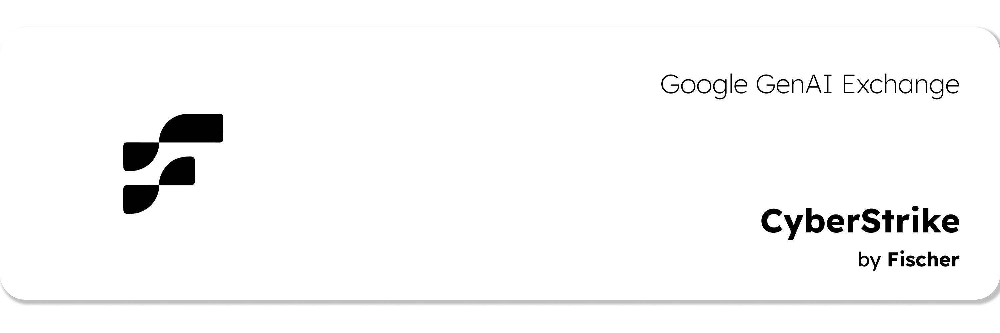
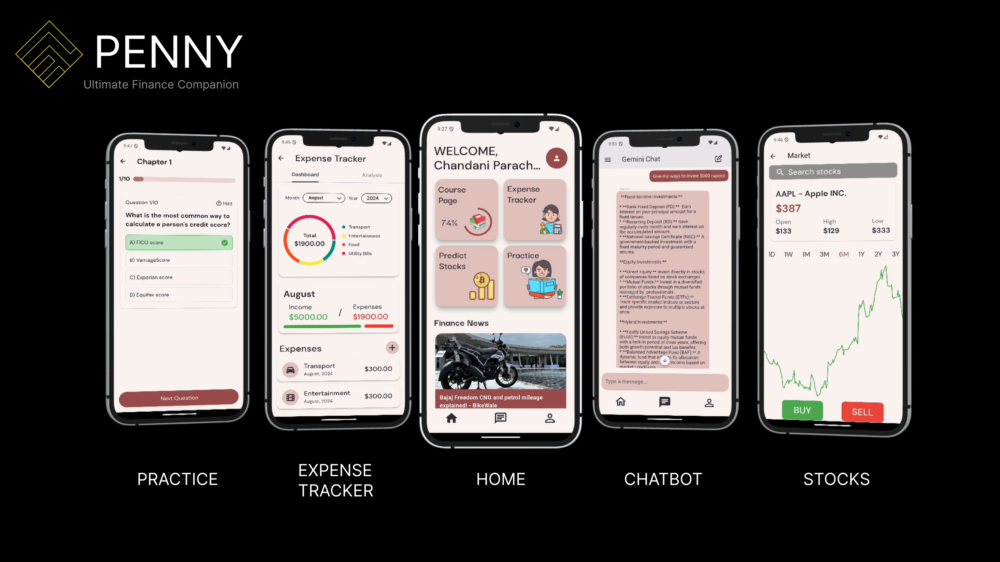

<div class="header-container">
  <h1 class="glitch-header">Girish Raghav M</h1>
  <p class="subtitle">Electronics & Computer Science | AI & ML Enthusiast | Backend Developer</p>
  <div class="social-links">
    <a href="https://github.com/wreckage0907" target="_blank">GitHub</a> |
    <a href="https://www.linkedin.com/in/girish-raghav-m/" target="_blank">LinkedIn</a> |
    <a href="mailto:girish.raghav2004@gmail.com">Email</a>
  </div>
</div>

* * *

## $ whoami

```
I am a passionate Electronics and Computer Science student with expertise in AI, machine learning,
and backend development. My interests span from developing intelligent systems to solving complex
algorithmic challenges. When not coding, I'm usually exploring new technologies, participating
in hackathons, or contributing to open-source projects.
```

* * *

## $ cat education.txt

```bash
# Vellore Institute of Technology, Chennai Campus (2022 - 2026)
$ echo $DEGREE
> B.Tech in Electronics and Computer Science
$ echo $CGPA
> 8.91/10.0

# Key Coursework
$ ls ./courses
> Data_Structures.py
> Algorithms.cpp
> Object_Oriented_Programming.java
> Digital_Electronics.v
> Computer_Architecture.asm

# Bala Vidya Mandir, Adyar (2020 - 2022)
$ echo $CLASS
> CBSE Class 12
$ echo $SCORE
> 92.8%
```

* * *

## $ ps -ef | grep experience

```yaml
UID     PID     TIME    CMD
girish  0001    6m      Backend Engineering Intern @ ProWiz Analytics (Nov 2024 - Present)
                        - Engineered high-performance backend endpoints that efficiently 
                          process and analyze diverse data from machine learning pipelines
                        - Implemented scalable solutions to handle complex data processing requirements
                        - Technologies: FastAPI, SQL, Docker
```

* * *


## $ echo "Project Highlights"

<div class="project-details">
  <div class="project-card">
    <h3>CyberStrike AI</h3>
    <p class="project-date">October 2024</p>
    
    <p>A cutting-edge multi-agent system that leverages Retrieval-Augmented Generation to automate cybersecurity audit analysis. The platform extracts insights from unstructured security reports to identify vulnerabilities and provide actionable recommendations.</p>
    <div class="project-links">
      <a href="https://github.com/sr2echa/CyberStrike" class="btna">View on GitHub</a>
    </div>
  </div>

  <div class="project-card">
    <h3>Penny</h3>
    <p class="project-date">May 2024</p>
    
    <p>An AI-powered personal finance application that helps users track spending, provides financial insights, and offers investment guidance through an intelligent chatbot interface built with Gemini API.</p>
    <div class="project-links">
      <a href="https://github.com/wreckage0907/Penny" class="btna">View on GitHub</a>
    </div>
  </div>
</div>


* * *

## $ cat achievements.log

```
[2024-10] Google GenAI Exchange — Winner
         - Won the Cybersecurity Audit Report Analysis track
         - Developed a sophisticated Multi-Agent RAG system

[2023-11] REVA Hack (MLH Event) — Winner
         - Developed DMD, a system for detecting fraudulent crypto transactions
         - https://github.com/sr2echa/DMD

[2023-03] ICPC Regionalist 2022-23
         - Qualified and competed in the prestigious ICPC Amritapuri Regionals
         - https://drive.google.com/file/d/1d4cwYp5A-9vde1rapJm_FqsfPNmtkJRn/view
```

* * *

## $ apt list --installed

<div class="skills-container">
  <div class="skill-category">
    <h3>Programming Languages</h3>
    <div class="skill-list">
      <span class="skill-tag">Python</span>
      <span class="skill-tag">C++</span>
      <span class="skill-tag">Java</span>
    </div>
  </div>
  
  <div class="skill-category">
    <h3>Frameworks & Tools</h3>
    <div class="skill-list">
      <span class="skill-tag">FastAPI</span>
      <span class="skill-tag">Flask</span>
      <span class="skill-tag">TensorFlow</span>
      <span class="skill-tag">OpenCV</span>
      <span class="skill-tag">Selenium</span>
      <span class="skill-tag">Streamlit</span>
      <span class="skill-tag">scikit-learn</span>
    </div>
  </div>
  
  <div class="skill-category">
    <h3>Databases</h3>
    <div class="skill-list">
      <span class="skill-tag">SQL</span>
      <span class="skill-tag">MongoDB</span>
      <span class="skill-tag">Firebase</span>
    </div>
  </div>
  
  <div class="skill-category">
    <h3>DevOps</h3>
    <div class="skill-list">
      <span class="skill-tag">Docker</span>
      <span class="skill-tag">Git</span>
      <span class="skill-tag">Google Cloud</span>
      <span class="skill-tag">Firebase Hosting</span>
    </div>
  </div>
</div>

* * *

## $ sudo cat /etc/certifications

```
Machine Learning Specialization — DeepLearning.AI
Issued: July 2023
```


<footer>
  <div class="terminal-prompt">
    <span class="prompt-user">girish@developer</span>:<span class="prompt-location">~/portfolio</span>$ <span class="prompt-cursor">█</span>
  </div>
  
  <p class="copyright">© 2025 Girish Raghav M. All rights reserved.</p>
</footer>

<style>
/* Custom styles to enhance Hacker theme */
.header-container {
  text-align: center;
  margin-bottom: 40px;
}

.glitch-header {
  text-shadow: 0.05em 0 0 rgba(255,0,0,0.75), -0.025em -0.05em 0 rgba(0,255,0,0.75), 0.025em 0.05em 0 rgba(0,0,255,0.75);
  animation: glitch 500ms infinite;
}

.subtitle {
  font-size: 1.2em;
  color: #6c6;
  margin-bottom: 15px;
}

.social-links {
  font-size: 0.9em;
}

.social-links a {
  color: #0c0;
  text-decoration: none;
  padding: 0 10px;
  transition: color 0.3s;
}

.social-links a:hover {
  color: #0f0;
  text-decoration: underline;
}

.skills-container {
  display: grid;
  grid-template-columns: repeat(auto-fit, minmax(250px, 1fr));
  gap: 20px;
}

.skill-category h3 {
  color: #0c0;
  border-bottom: 1px solid #333;
  padding-bottom: 5px;
}

.skill-list {
  display: flex;
  flex-wrap: wrap;
  gap: 10px;
  margin-top: 10px;
}

.skill-tag {
  background: rgba(0, 204, 0, 0.1);
  border: 1px solid #0c0;
  color: #0c0;
  padding: 3px 8px;
  border-radius: 3px;
  font-family: monospace;
  font-size: 0.9em;
}

.project-details {
  display: grid;
  grid-template-columns: repeat(auto-fit, minmax(300px, 1fr));
  gap: 30px;
}

.project-card {
  border: 1px solid #333;
  padding: 15px;
  border-radius: 5px;
  background: rgba(0, 0, 0, 0.2);
}

.project-date {
  color: #999;
  font-style: italic;
  margin-top: -10px;
}

.project-image {
  width: 100%;
  height: auto;
  margin: 10px 0;
  border: 1px solid #333;
}

.btna {
  display: inline-block;
  background: #0c0;
  color: #000;
  padding: 5px 15px;
  text-decoration: none;
  border-radius: 3px;
  font-weight: bold;
  margin-top: 10px;
}
.btna a:hover {
  text-decoration: underline;
}

.terminal-prompt {
  font-family: monospace;
  margin: 20px 0;
}

.prompt-user {
  color: #0c0;
}

.prompt-location {
  color: #06a;
}

.prompt-cursor {
  animation: blink 1s step-end infinite;
}

.copyright {
  text-align: center;
  color: #666;
  margin-top: 20px;
  font-size: 0.8em;
}

@keyframes glitch {
  0% {text-shadow: 0.05em 0 0 rgba(255,0,0,0.75), -0.025em -0.05em 0 rgba(0,255,0,0.75), 0.025em 0.05em 0 rgba(0,0,255,0.75);}
  14% {text-shadow: 0.05em 0 0 rgba(255,0,0,0.75), -0.025em -0.05em 0 rgba(0,255,0,0.75), 0.025em 0.05em 0 rgba(0,0,255,0.75);}
  15% {text-shadow: -0.05em -0.025em 0 rgba(255,0,0,0.75), 0.025em 0.025em 0 rgba(0,255,0,0.75), -0.05em -0.05em 0 rgba(0,0,255,0.75);}
  49% {text-shadow: -0.05em -0.025em 0 rgba(255,0,0,0.75), 0.025em 0.025em 0 rgba(0,255,0,0.75), -0.05em -0.05em 0 rgba(0,0,255,0.75);}
  50% {text-shadow: 0.025em 0.05em 0 rgba(255,0,0,0.75), 0.05em 0 0 rgba(0,255,0,0.75), 0 -0.05em 0 rgba(0,0,255,0.75);}
  99% {text-shadow: 0.025em 0.05em 0 rgba(255,0,0,0.75), 0.05em 0 0 rgba(0,255,0,0.75), 0 -0.05em 0 rgba(0,0,255,0.75);}
  100% {text-shadow: -0.025em 0 0 rgba(255,0,0,0.75), -0.025em -0.025em 0 rgba(0,255,0,0.75), -0.025em -0.05em 0 rgba(0,0,255,0.75);}
}

@keyframes blink {
  0%, 100% {opacity: 1;}
  50% {opacity: 0;}
}
</style>
